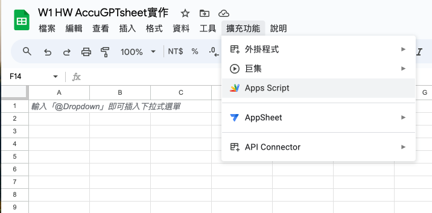

# W1_HW AccuGPTsheet實作
## 分為兩個部分
**1. 按照github的Readme操作**

**2. 自己修改了main.js，增加一個文字生圖的功能**

--- 
## 按照github的Readme操作
**1.  先在Google Sheet建立一個新的文件，命名檔案名稱(W1 HW AccuGPTsheet實作)**


**2.  點擊上方擴充功能->Apps Script**


**3.  修改檔案命名(AccuGPTsheet實作)**


**4.  前往課程提供的AccuGPTsheet Github連結，複製main.js檔案**
[AccuGPTsheet main.JS](https://github.com/accucrazy/AccuGPTsheet/blob/main/main.js)

**5.  將main.js 貼上Apps Script**


**6.  獲取OpenAI Key，登入Open AI後訪問下方網址**

[申請OpenAI Key](https://platform.openai.com/api-keys)


**7.  點擊Creat new secret Key，給Key一個名稱(AI_W1_HW)，再點擊Creat secret Key，然後複製secret Key**


**8.  回到Apps Script頁面，將secret Key貼到第23行YOUR_OPENAI_API_KEY**


**9.  點擊偵錯->審查授權->選擇google帳戶->進階->前往「AccuGPTsheet實作」(不安全)->允許**


**10.  回到Goole Sheet(W1 HW AccuGPTsheet實作)會看到上方工具列多一個**


### 以上是按照課程所教學得進行操作

# 自己修改了main.js，增加一個文字生圖的功能

**1-1.  修改代碼4-10行，將功能菜單轉換為中文**
```
function onOpen() {
  var ui = SpreadsheetApp.getUi();
  ui.createMenu('AccuGPTsheet')
      .addItem('針對單一輸入格執行', 'getSingleResponse')
      .addItem('針對整個資料表執行', 'batchUpdateResponses')
      .addToUi();
}
```
**1-2  修改代碼13-18行，將提示訊息轉為中文**
```
function displayLoadingDialog() {
  var htmlOutput = HtmlService.createHtmlOutput('<p>執行中... 請稍候</p>')
                               .setWidth(250)
                               .setHeight(100);
  SpreadsheetApp.getUi().showModalDialog(htmlOutput, '獲取回應');
}
```


**2.  執行針對單一輸入格執行**


**3.  執行針對整個資料表執行**


**4.  新增文字生成圖片功能，獲取A1的輸入需求傳遞給OpenAI文字生圖的API，將API回傳的URL放進B1欄位**


## 修改代碼如下 ##
```
//menu增加一個功能，方法名稱getimagesResponse
.addItem('單一文字生成圖片', 'getimagesResponse')
```

```
function callGPT4imagesgenerations(query) {
  try {
    var apiKey = 'YOUR_OPENAI_API_KEY';  // Replace with your OpenAI API key
    var apiEndpoint = 'https://api.openai.com/v1/images/generations';

    var headers = {
      "Authorization": "Bearer " + apiKey,
      "Content-Type": "application/json"
    };
    
    var payload = {
       "model": "dall-e-3",
      "prompt": query,
      "n": 1,
      "size": "1024x1024"
    };
    
    var options = {
      "method": "POST",
      "headers": headers,
      "payload": JSON.stringify(payload),
      "muteHttpExceptions": true
    };
    
    var response = UrlFetchApp.fetch(apiEndpoint, options);
    var jsonResponse = JSON.parse(response.getContentText());
    
    if (jsonResponse.data && jsonResponse.data.length > 0) {
      return jsonResponse.data[0].url;
    } else {
      Logger.log("API Response Error: " + JSON.stringify(jsonResponse));
      return "Error: Unable to fetch response";
    }
  } catch (error) {
    Logger.log("Error in callGPT3Turbo16kAPI: " + error.toString());
    return "Error: " + error.toString();
  }
}

// Function to fetch a response for the content of the cell currently selected by the user
function getimagesResponse() {
  var sheet = SpreadsheetApp.getActiveSpreadsheet().getActiveSheet();
  var cellValue = sheet.getActiveCell().getValue();
  
  if (cellValue) {
    // Show the loading dialog
    displayLoadingDialog();
    
    // Fetch the response
    var response = callGPT4imagesgenerations(cellValue);

    // Close the loading dialog after a short delay
    Utilities.sleep(2000);  // 2 seconds delay
    SpreadsheetApp.getUi().alert('Done!');
    
    // 假設response是圖片的URL
    var imageUrl = response; // 這裡的response變量應該包含圖片的URL

    // 更新B列，使用IMAGE函數來插入圖片
    var cellFormula = '=IMAGE("' + imageUrl + '", 4, 512, 512)';
    sheet.getRange(sheet.getActiveCell().getRow(), 2).setFormula(cellFormula);
    
  }
}
```