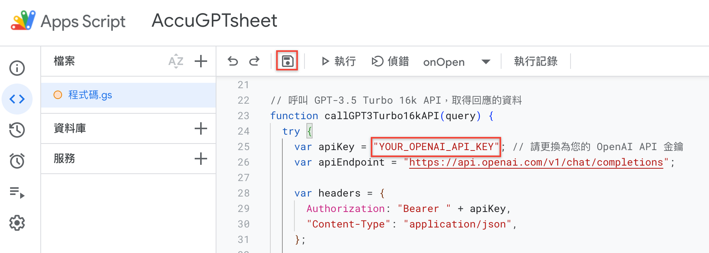
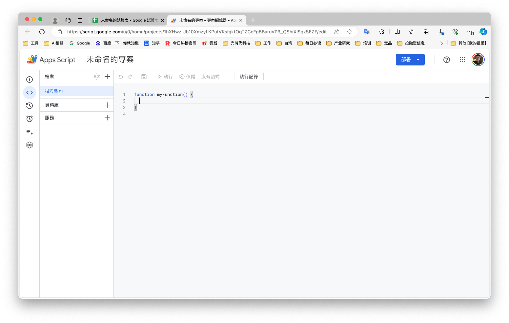
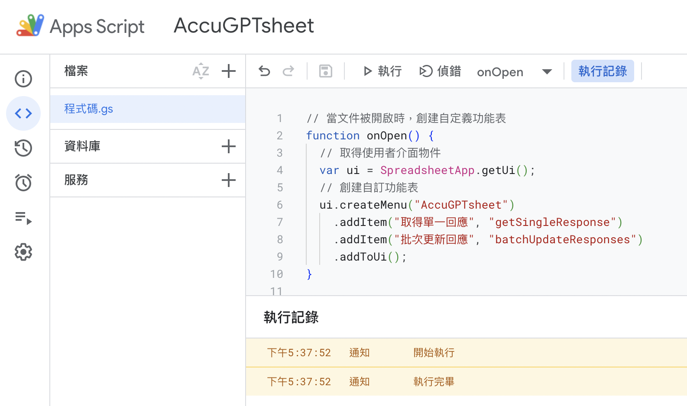
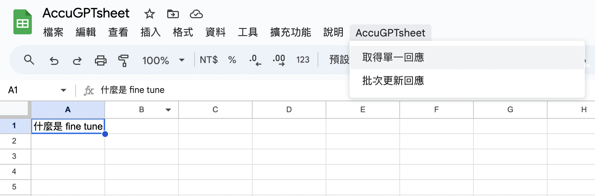
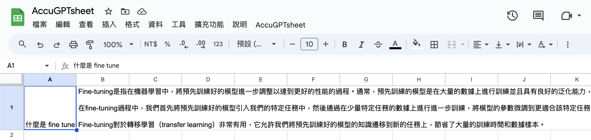

# AccuGPTsheet

AccuGPTsheet 為老師提供的範例，透過 google sheet 直接呼叫 openai，取得回應內容
[https://github.com/accucrazy/AccuGPTsheet](https://github.com/accucrazy/AccuGPTsheet)

AccuGPTsheet.js 為加上註解的版本。

1. 打開 Google Sheets，點擊選單的 附加元件 > Apps Script。
   
2. 貼上 AccuGPTsheet.js 的內容，並且更換為自己的的 OpenAI API 金鑰，在點擊儲存。
   
3. 點擊執行。
   
4. 執行完畢。
   
5. 輸入問題後，點擊選單的 AccuGPTsheet > 取得單一回應。
   
6. 執行完畢後，會在 B 欄顯示回應。
   
