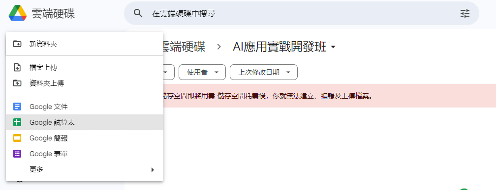

# AccuGPTsheet 使用指南

AccuGPTsheet 是一個集成於 Google 試算表的工具，讓使用者能夠直接從試算表中調用 OpenAI 的 GPT-3.5 Turbo 16k API 來獲取文本回應。以下是使用這個工具的步驟指南。

## 開始之前的準備

- 確保擁有 Google 帳戶，並能夠訪問 Google 試算表。
- 獲取 OpenAI 的 API 金鑰。

## 步驟一：創建和設置試算表

1. 打開 Google 試算表，創建一個新的試算表。
   

2. 選擇「擴充功能」>「Apps Script」。
   

3. 將提供的程式碼貼入指令碼編輯器。
   

4. 替換`YOUR_OPENAI_API_KEY`為個人的 OpenAI API 金鑰。
   

5. 儲存並關閉指令碼編輯器。
   

6. 執行 onOpen 函數，並授權。
   
   
   
   

7. 返回試算表，會看到一個新的菜單「AccuGPTsheet」。
   

## 步驟二：單筆回應獲取

1. 在 A 欄輸入查詢。
   
2. 選擇該儲存格，並從「AccuGPTsheet」菜單選擇「Get Single Response」。
   

3. 等待回應在 B 欄更新。
   

4. 截圖試算表顯示的查詢和回應
   

## 步驟三：批量更新回應

1. 在 A 欄輸入多個查詢。
   

2. 選擇「AccuGPTsheet」菜單中的「Batch Update Responses」。
   

3. 等待所有回應在 B 欄更新。
   

4. 截圖展示全部查詢和對應回應。
   

## 總結

描述操作過程中的體驗，例如對函式的理解、遇到的挑戰以及解決方案，以及這個工具如何幫助提升學習和工作效率。

使用 chatgpt 規劃 markdown 操作步驟，跟著一步一步操作，很順利的完成了，還在思考可以應用在哪一個地方。

