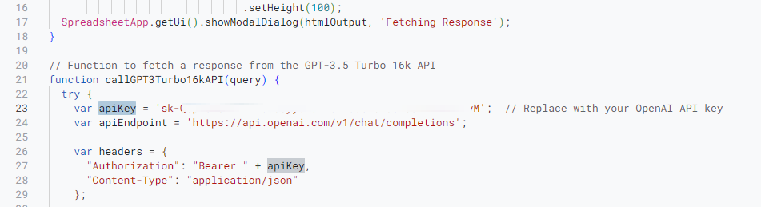

## AccuGPTsheet 練習

**AccuGPTsheet 是一款能夠在 Google Sheets 中直接調用 GPT-3.5 Turbo API 的工具。您可以輕鬆地為某一列的所有內容取得相應的回應，或是為當前選中的單一儲存格取得回應**

## 安裝與設定
- 首先安裝外掛，並授權啟用
https://workspace.google.com/marketplace/app/gpt_for_sheets_and_docs/677318054654
-   Script 編輯器 首先，打開您的 Google Sheets，然後點擊上方的 附加元件 > Apps Script 以開啟 Google Apps Script 編輯器。

-   貼上 script 在 script 編輯器中，刪除所有預設的程式碼，然後將提供的 "AccuGPTsheet" script 完整複製並貼上。(main.js)

-   設定 API 金鑰 在 script 中找到 'YOUR_OPENAI_API_KEY'，並將其替換為您的實際 OpenAI API 金鑰。
https://platform.openai.com/api-keys

貼上 Key

-   儲存並離開 點擊編輯器上方的 檔案 > 儲存，然後關閉 script 編輯器。

## 使用方法
-   啟動工具 重新載入或打開您的 Google Sheets 文件，您應該可以在選單欄中看到名為 "AccuGPTsheet" 的新選單。

-   取得單一回應 在工作表的 A 列選擇您想查詢的儲存格。 點擊 "AccuGPTsheet" 選單，然後選擇 Get Single Response。 您將在相應的 B 列儲存格中看到 GPT-3.5 Turbo 的回應。

-   批次取得回應 在 A 列填入您想查詢的內容。 點擊 "AccuGPTsheet" 選單，選擇 Batch Update Responses。 工具將為 A 列的每一行取得回應，並在 B 列填入相應的回應。

