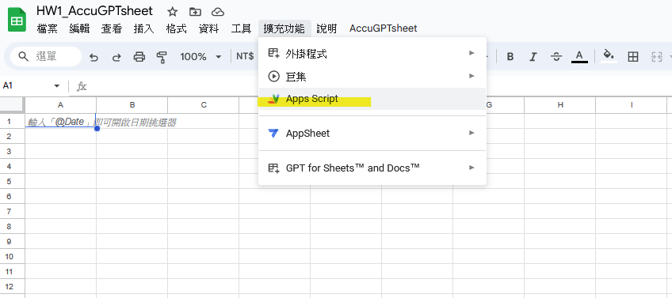

# Week1 Homework:
**A). 照著 Readme 跑講師介紹的開源工具 AccuGPTsheet（連結在上面），用自己的話寫出中間執行的步驟並提供過程與成功結果截圖.**

---
1. 開啟google worksheet,選擇"擴充功能\AppScript".

<!---->

2. 至[AccuGPTsheet](https://github.com/accucrazy/AccuGPTsheet)的main.js內複製所有內容(code).

<!---->

3. 回到Apps Script頁面,將步驟2.的複製內容完全覆蓋"程式碼.gs"內容,並儲存.

 <!---->
 
 
4. 至Google sheet中執行查詢結果出現錯誤訊息如下("Unable to fetch response").

 <!---->
 
 
 <!---->
 
 
5. 進入Apps Script進行偵錯後發現OpenAI實際回傳的錯誤訊息為"insufficient_quota".

 <!---->
 

6. 回到OpenAI的usage網頁查詢才發現原有的free ５美元quota早已於去年過期.

<!---->
 
 
7. 經充值後已可正常透過Goole Sheet利用AccuGPTsheet功能進行查詢.

<!---->
 

-----

---

**B). 閱讀這邊文章（也歡迎去 youtube 上查 langchain 關鍵字，看影片可更快速幫助理解），並用自己的話總結出 Langchain 的五大優點**

---
LangChain提供一個有彈性且一致性的框架,用來載入各種現成的大型語言模型(LLM)並提供串接輸入端及輸出端的標準接口,可以提供使用者更快的導作及完成所需要的功能,並且可以更快速的切換不同LLM,以做為效能評估找出最合適的模型.

