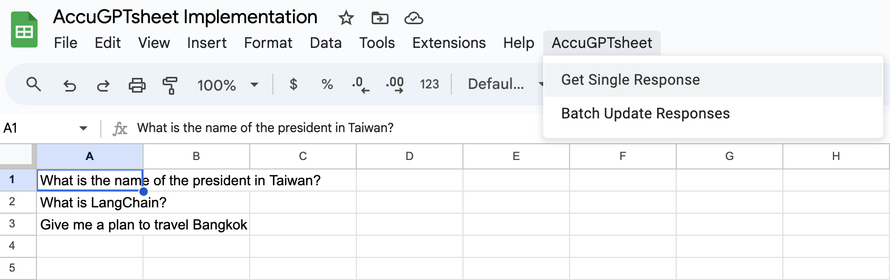

# AccuGPTsheet Implementation
## Introduction
[AccuGPTsheet](https://github.com/accucrazy/AccuGPTsheet) allows us to run GPT-3.5 Turbo in Google Sheet.

## Installation and Setup
1. Open Google Sheet and then click on the "Extensions -> Apps Script" to launch the Google Apps Script editor

2. Rename App Script to "AccuGPTsheet"

3. Delete all code in the original App Script and paste all content in "[AccuGPTsheet](https://github.com/accucrazy/AccuGPTsheet) -> [main.js](https://github.com/accucrazy/AccuGPTsheet/blob/main/main.js)" to App Script

 

3. Find "apiKey" in the code and replace it with your own API Key (you can find API Key in Openai at [this website](https://platform.openai.com/playground/chat), do not forget to pay for the bills if your quota is used up)

4. Click on "Save project" on the top of the script and close the script editor

## Usage examples

1. Close Google Sheet and reload it, you will see "AccuGPTsheet" in the tool box next to "Help"

2. Enter any query in a cell, you can do different queries in different cells

3. Click on a query(cell) that you want GPT to answer and click "AccuGPTsheet -> Get Single Response" (You may asked for entering google account in this stage)

**if you have this problem while entering google account, here are some tutorials of solving this problem by using [Google Cloud](https://console.cloud.google.com/welcome/new): [Chinese Tutorial](https://realnewbie.com/front-end/this-app-is-blocked/), [English Tutorial](https://stackoverflow.com/questions/67898285/how-to-resolve-this-app-is-blocked-error-for-shared-google-apps-script-library)** 

4. Finally, you can see the response from GPT-3.5 Turbo in the Google Sheet !

5. Keep doing queries and get respones as many as you want !

