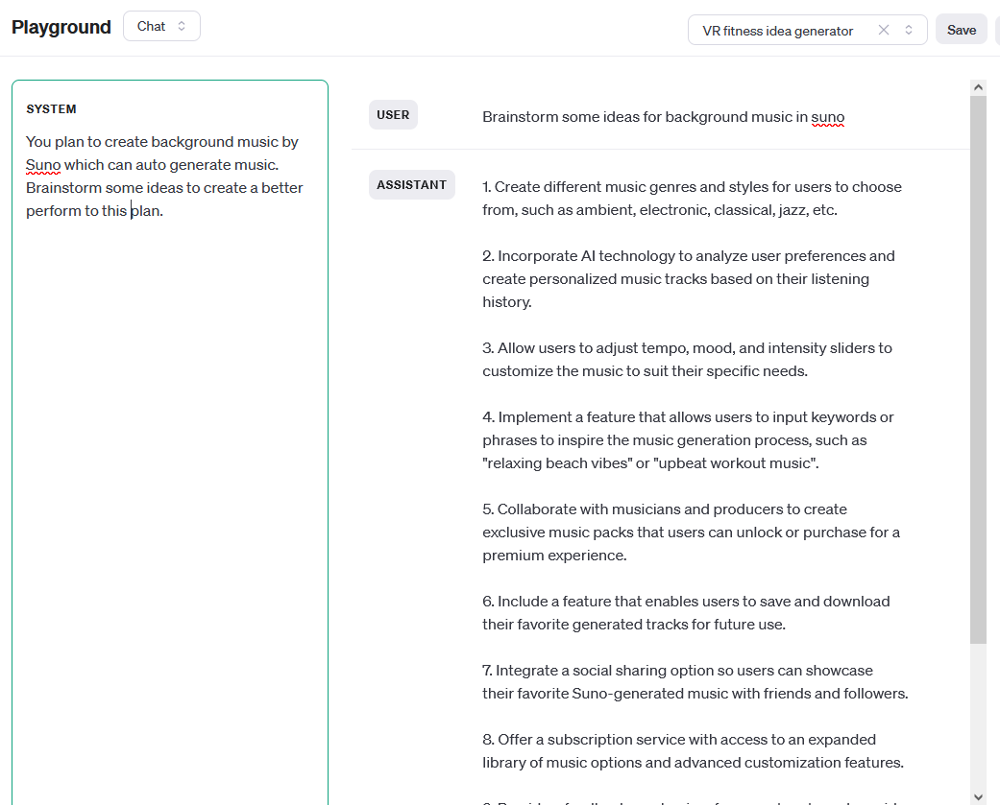
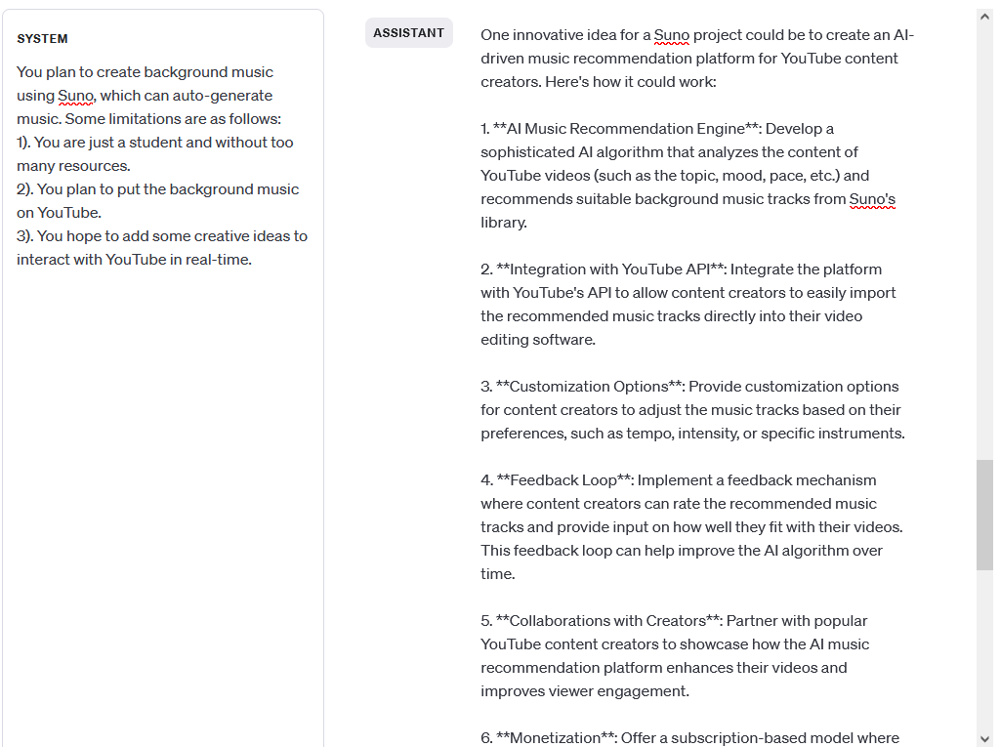
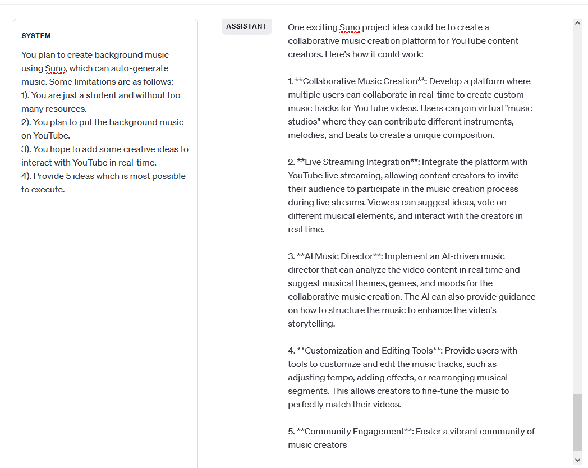

# Week2 Homework:
**A). 嘗試用上課中提到的七種優化 prompt 方法，為你想做的畢業專案題目寫完整的 prompt，並附上最終的 prompt 與調教成功的對話範例截圖**

---
1. 利用ChatGPT來幫忙想利用Suno來生成音樂的一些比較有創意的想法.
   - 未加上限制條件,提案範圍太廣泛.

2. 加入三個限制條件後,產生較為可行的想法.
   - 數量仍太多.

3. 再加入第四個限制只產生五個idea條件後,縮減至產生五個想法.
   - 數量仍太多.

 

-----

