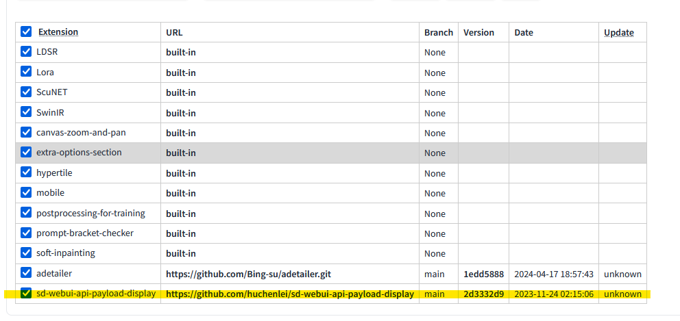
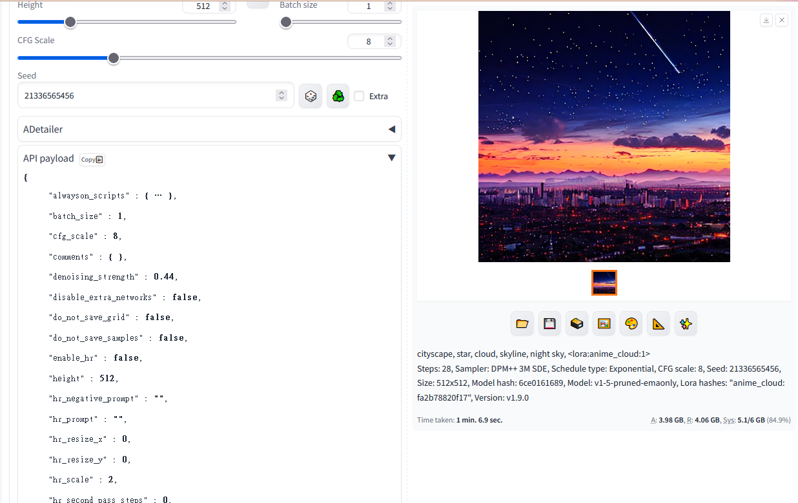
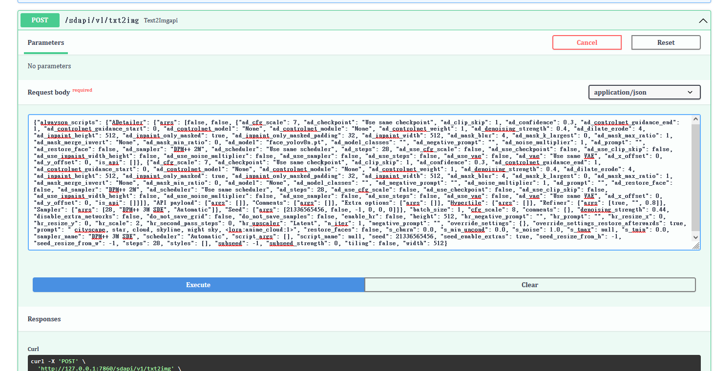
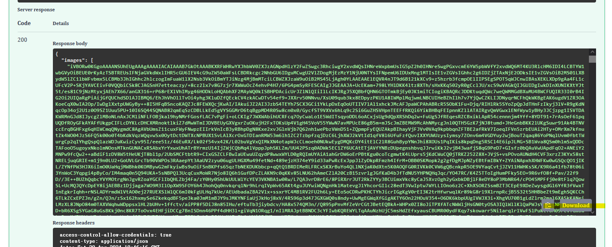
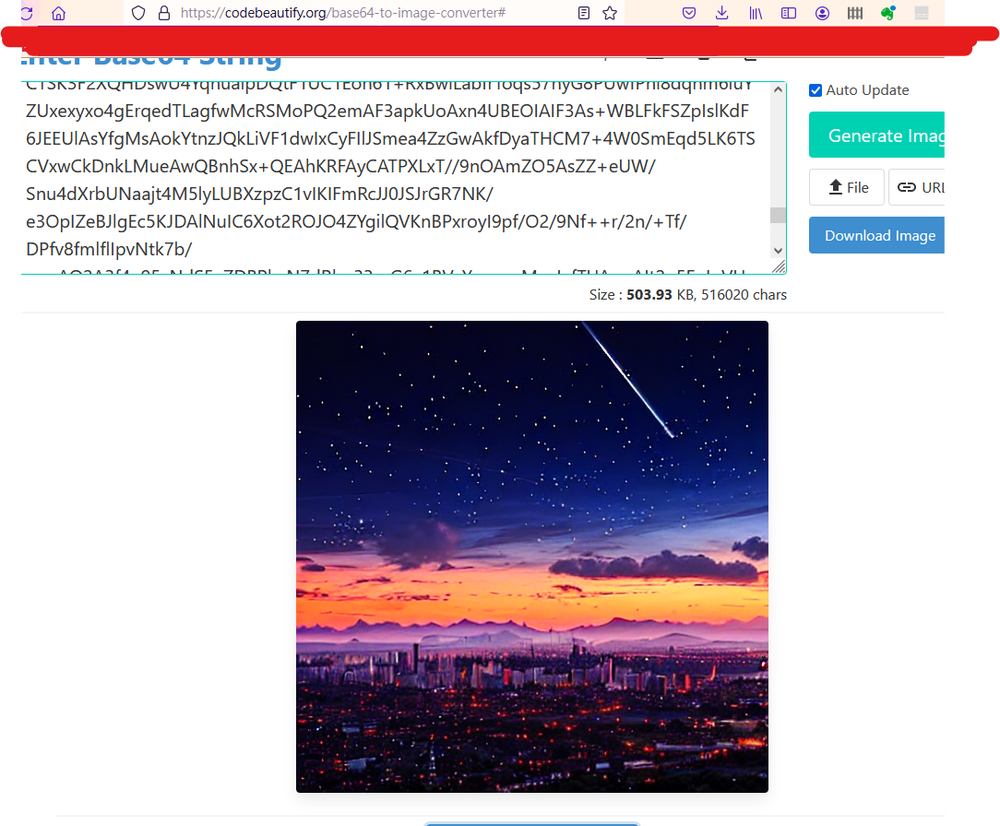
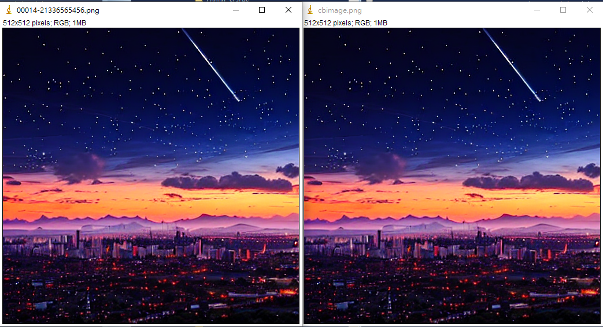

# Week2 Homework

**B). 安裝 stable diffusion webui 到本地，並啟用 —api，在安裝以上介紹的 payload 插件後，找到這個 api（本地網址/docs#/default/text2imgapi_sdapi_v1_txt2img_post）按下 try it out，貼上 payload，將回傳成功的圖片顯示出來**

---

1. 複製網址***API payload display*** - <https://github.com/huchenlei/sd-webui-api-payload-display後至SD> 加入Extension.

2. 生成圖像後在右下方打開*API payload**欄位複製生成參數內容.

3. 至網址<http://127.0.0.1:7860/docs#/default/text2imgapi_sdapi_v1_txt2img_post,將步驟2內容貼上後按下"Execute",再重覆生成圖像>.

4. 圖像再次生成後可在欄位"Response body"看到base64格式傳輸的圖像資料.

5. 利用goole search可找到網路上將base64轉換成圖像的工具,轉換後下載圖像.

6. 比較利用SD網頁填入參數生成及利用相同參數透過api介面生成的圖像相同.

- 可利用此api介面,即時在網頁前台傳送參數給後台SD server,以即時生成圖像後傳回前台顯示.

-----

-----
