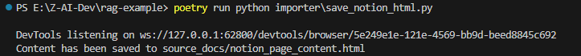

# 1-1 rag-example練習

## 安裝 LangChain CLI
```
pip install -U langchain-cli
```


## 安裝 poetry 
先安裝 Scoop (Windows 套件管理工具)

打開 PowerShell，輸入以下指令
```
Set-ExecutionPolicy -ExecutionPolicy RemoteSigned -Scope CurrentUser
Invoke-RestMethod -Uri https://get.scoop.sh | Invoke-Expression
```


## 安裝 pipx
scoop install pipx
pipx ensurepath  #將 pipx 加入PATH環境變數


memo：
- 基於 pip 同樣也有 list、upgrade 和 uninstall 套件的功能。
- 可以在安裝套件時為每個套件建出一個分離的環境，並可以在不啟動虛擬環境的情況下直接使用。
- 在暫時的虛擬環境中執行最新版的套件功能。
- 另外，所有指令都不會需要 root 權限，一切都在使用者權限下進行。


## 安裝 pipx - 套件管理器
```
pipx install poetry
```


## 回專案執行
Set .env first by copying .env.example to .env and fill in the necessary information like OPENAI_API_KEY
Put markdown files in source_docs folder

```
pip install -U langchain-cli
poetry install
```

```
poetry run python importer\save_notion_html.py
```
遇到沒裝套件 selenium 的錯誤

## 安裝 selenium 
poetry add selenium

重新執行 save_notion_html.py 成功


then
## 爬網頁內容
```
poetry run python importer/html_process_google.py
```
需先在 .env 輸入 GOOGLE_API_KEY
成功執行後，會產生 EMBEDDING 後的檔案


如果是 .md 檔案，可以執行這隻。
poetry run python importer/load_and_process.py

then
```
poetry run python app/server.py
```
成功開啟 langserve


