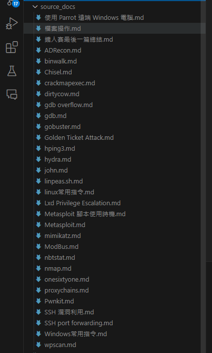
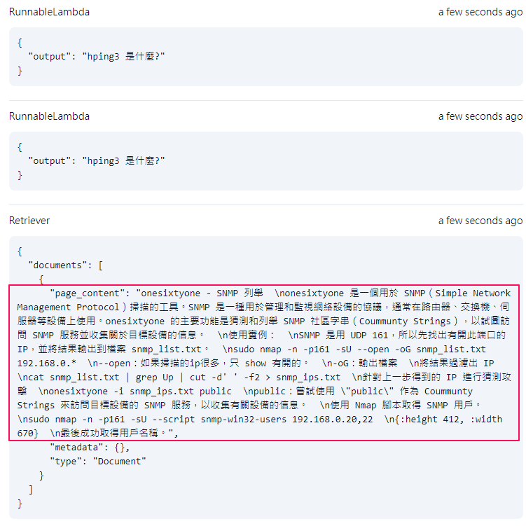
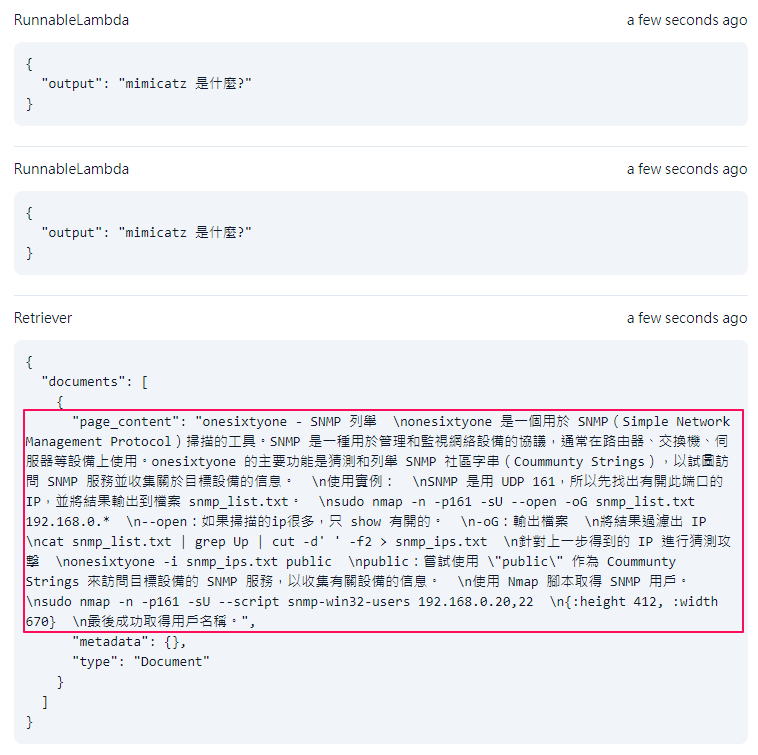
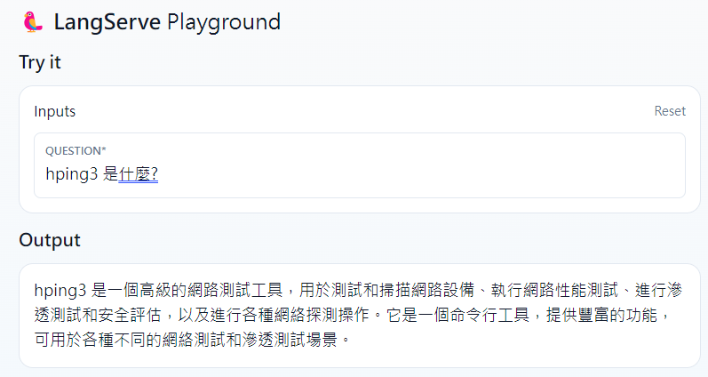
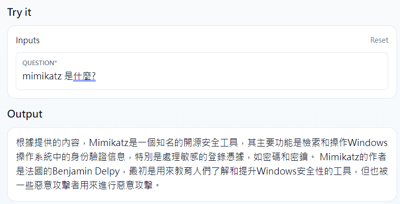

# 1-2 rag換成自己的內容

## 將 source_docs 內的檔案替換成自己準備 CPENT 的學習筆記


執行 importer/load_and_process.py 來建立自己的向量資料庫

但不管怎麼問，都只會找到同樣一筆向量資料。



後來改寫這段，並成功將其他 markdown 檔案的內容整併進去 embedding 索引中。

``` csharp
db = FAISS.from_documents(chunks, embeddings)

for doc in docs:
    chunks = markdown_splitter.split_text(doc.page_content)
    db.add_documents(chunks)

db.save_local("faiss_index")
```

