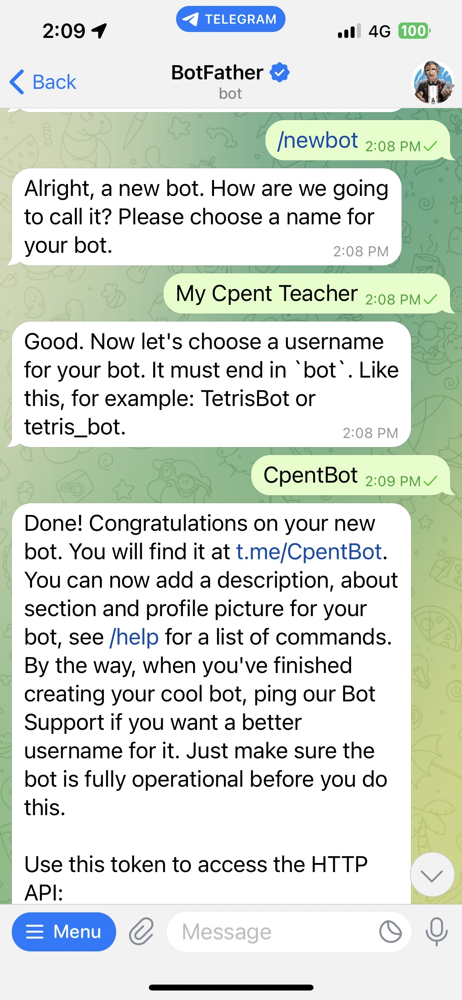

# 1-3 做一個自己的 telegram bot

## 去 https://telegram.me/BotFather 私訊他 /newbot 建立一個新的 telegram bot，把 bot token 放入 env，嘗試參考範例中 bot.py 做一個自己的 telegram bot
申請 Telegram 機器人
加入 https://telegram.me/BotFather 為好友，
傳送 /newbot 進行新增機器人的動作，接著會問你 name、username 要取什麼。
name是機器人名稱，username 會跟加入好友的網址有關。
成功建立後，會給你 API token。

執行程式
poetry run python bot.py

遇到錯誤

缺少套件 telegram，執行下面指令安裝。
poetry add python-telegram-bot

遇到錯誤 ImportError: cannot import name 'Filters' from 'telegram.ext'

新版本的 python-telegram-bot 套件需改寫法

遇到錯誤

os.environ.get("BOT_TOKEN")
這邊一直取錯，取成 xxx，可能是 VS code暫存，重新啟用 VS code 就正常了。

測試畫面

