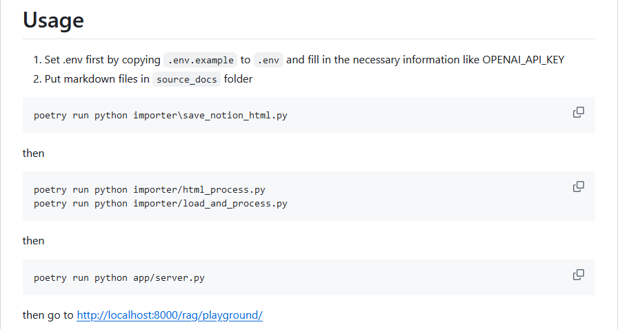

# Week3 Homework:
**A). 照著 rag-example 的 readme 跑看看整個安裝到成功開啟 langserve 的頁面流程（http://localhost:8000/rag/playground/）**

---
1. Git clone https://github.com/z-institute/rag-example.git 下載範例後,啟用poetry virtual enviroment後再下 poetry update更新模組.

2. 用命令 poetry show langchain-cli 確認langchain模組已加入環境中.

3. 按照範例說明,申請OPENAI_API_KEY及GOOGLE_API_KEY後更新至.env檔案中.

4. 執行完後可在Terminal看到langSever順利啟動的畫面.

---
**B). 替換以上範例中 source_docs 資料夾內的檔案內容成自己的內容，並重複以上流程，建立懂自己資料的 AI chatbot**

---
1. 將個人資料轉為md格式檔案後置於目錄\source_docs下再依序執行load_process及啟動server.
2. 啟動後網頁輸入相關問題即可見到回答.

---

**C). 去 https://telegram.me/BotFather 私訊他 /newbot 建立一個新的 telegram bot，把 bot token 放入 env，嘗試參考範例中 bot.py 做一個自己的 telegram bot**
---
1. 向telegram BotFather申請bot machine後可取得HTTP API.

2. 執行命令 poetry run python .\bot.py 出現錯誤,未找到模組telegram.

3. 執行命令 poetry add python-telegram-bot 下載所需要模組telegram.

4. 再次執行命令 poetry run python .\bot.py 仍出現錯誤"ImportError:cannot import name 'Filters'....

5. 透過ChatGPT查詢可能問題,後至 GitHub python-telegram-bot 專案尋找問題原因.

6. 先下載 python-telegram-bot 專案提供的example 'python-telegram-botconversationbot2.py'來執行,確認可執行且練習如何透過telegram bot來互動後,著手修改bot.py.

7. 確認可執行且練習如何透過telegram bot來互動後,著手修改bot.py.

8. 修改後的bot.py已可在新版本的 python-telegram-bot 執行.

9. telegram bot會將收到的training data放在目錄 train_docs 下,可藉此觀察telegram至local是否可正常接收資料及儲存格式是否正確.

---