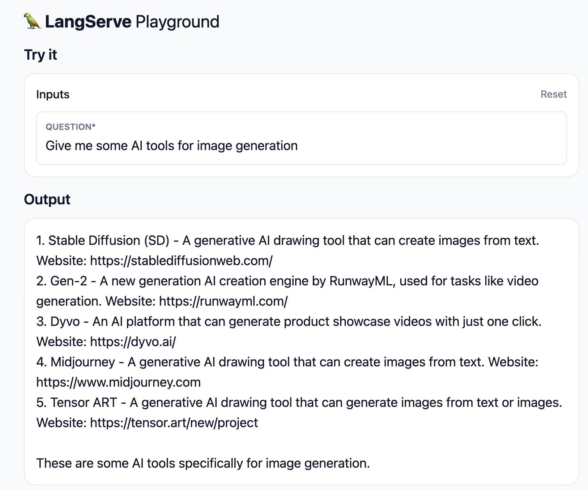
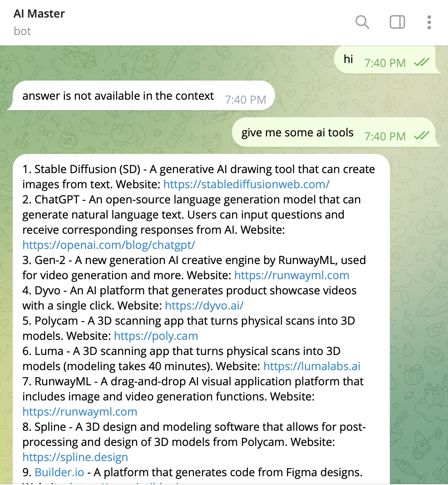

# Installing Rag-example Process (Mac OS)

Rag-example Github Link: https://github.com/z-institute/rag-example

## Step 1: Install Poetry to manage Python packages
As we want to manage our Python packages, we have to create a environment to split packages to different projects. Run the code below on your Terminal

```bash
pipx install poetry
```

If you have not install pipx, here is the method from [official pipx installation instructions](https://pipx.pypa.io/stable/installation/).

```bash
brew install pipx
pipx ensurepath
```

## Step 2: Install the LangChain CLI
Download all file in [Rag-example Github](https://github.com/z-institute/rag-example) by
```
git clone https://github.com/z-institute/rag-example.git
```
Run the code below on your Terminal as well.

```bash
pip install -U langchain-cli
poetry install
```
## Step 3: Download markdown file from source
source: https://the-z.notion.site/AI-4cda91de52aa40cb91114f9b78be456b

Add r.jina.ai in front of the URL to https://r.jina.ai/the-z.notion.site/AI-4cda91de52aa40cb91114f9b78be456b, this will make the website easier to be interpreted by LLMs.

Then copy to your empty markdown file in source_docs file

## Step 4: Run program using poetry

Add your openai API key to your environment fisrt. Then run the code below.

```
poetry run python importer/save_notion_html.py
````
This will save the sorce above as a .html file.
```
poetry run python importer/html_process_google.py
```
This will load the .html file and store the data as embedded vector.
```
poetry run python importer/load_and_process.py
```
This will load the file (the markdown file you store above) and store the data as embedded vector.

## Step 5: Access Langserve Interface
```
poetry run python app/server.py
```

After running the code above, open http://localhost:8000/rag/playground/ to access the interface.

Finally! You can ask something related to the source above.



## Telegram Bot Setting (Optional)

**Step 1:** Install telegram bot package in the older version such as 13.7, or there will be some issue in the code

```bash
pip install python-telegram-bot==13.7
```

**Step 2:** Open bot.py and replace this code (line 55)
```
vector_store = FAISS.load_local("all_faiss/"+ str(user_id) + "/faiss_index", embeddings, allow_dangerous_deserialization=True)
```
to

```
vector_store = FAISS.load_local("faiss_index", embeddings, allow_dangerous_deserialization=True)
```
So we can fix the file directory to avoid errors.

**Step 3:** add this telegram account to your telegram contact https://telegram.me/BotFather, and request your own bot by this command ` /newbot`. You will then get a bot access token. Add it to your environment afterward.

**Step 4:** Finally! You can run
```
python3 bot.py
```
and chat with your telegram bot! The telegram bot will answer your question by refering the source you gave as well !

